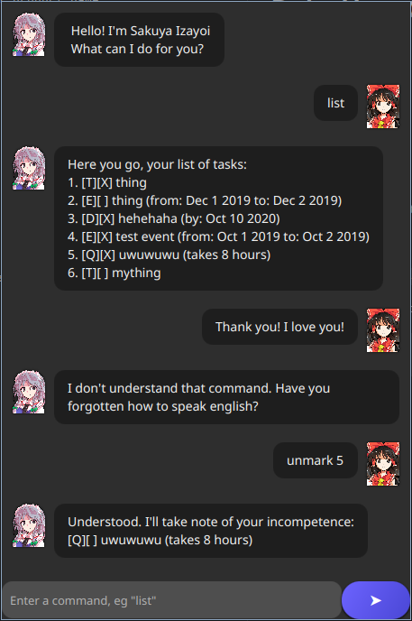

# Izayoi User Guide

> *"I-I’m only helping you because you’re hopeless, okay?! It’s not like I **care** about your productivity or anything... baka!"* 😳

Meet **Izayoi**, a chatbot inspired by *Sakuya Izayoi* who reluctantly helps you manage and plan your tasks. She may not have much functionality *yet*, but the **spirit** of a true assistant is there!



---

# Features
Sakuya Izayoi can do all of the following for you:
- [Lists all existing tasks](#viewing-tasks)
- [Add new tasks to your personal list](#creating-tasks)
- [Can mark tasks as done or undone](#marking-tasks)
- [Will delete tasks you don't want to do](#deleting-tasks)
- [Saves tasks and loads them for you](#task-saving)

Rest assured that Izayoi will do her best to verbally insult you at every step of the way!

## Viewing Tasks

To view your current lists of tasks, one simply needs to invoke the `list` command:

### Usage
Example: `list`

Output:
```
Here you go, your list of tasks:
1. [T][ ] read book 
2. [D][ ] return book (by: June 6th )
3. [E][ ] project meeting (from: Aug 6th 2pm to: 4pm )
4. [T][ ] join sports club 
5. [T][ ] borrow book 
```
The first box indicates the type of task, while the second box is only checked if the task is already completed.
This feature is important because task numbers can be used to modify existing tasks.

## Creating Tasks
To create a task, one should decide on what type of task they wish to create, and invoke its command with the appropriate arguments.

There are 4 types of tasks with the following capabilities:
- [Todo: Basic tasks with no start date or deadline](#todos)
- [Deadline: Tasks that must be completed before a specific date](#deadlines)
- [Event: Tasks that begin and end at a specific time](#events)
- [Timed: Tasks that take a specific duration to complete](#timed-tasks)

### Todos
A todo is a basic task that only needs to be marked as done or undone. Todos are indicated in a task list with the letter "T".

#### Usage
Command format: `todo [task description]`

Example: `todo my homework`

Output:
```
Ok, I've added the task:
[T][ ] my homework
You'll have 5 tasks now.
```

### Deadlines
Deadlines are tasks that must be completed before a specific deadline. Deadlines are indicated in the task list with the letter "D".

#### Usage
Command format: `deadline [task description] /by [date]`
* The date must follow the YYYY-MM-DD format for Izayoi to accept it.

Example: `deadline my project /by 2025-10-02`

Output:
```
Ok, I've added the task:
[D][ ] my project (by: Oct 2 2025)
You'll have 2 tasks now.
```

### Events
Events are tasks with both a start and end time. Events are indicated in the task list with the letter "E".

#### Usage
Command format: `deadline [task description] /from [date] /to [date]`
* Both dates must follow the YYYY-MM-DD format for Izayoi to accept it.

Example: `event hackathon /from 2025-10-03 /to 2025-10-04`

Output:
```
Ok, I've added the task:
[E][ ] hackathon (from: Oct 3 2025 to: Oct 4 2025)
You'll have 8 tasks now.
```

### Timed Tasks
Timed tasks are tasks that take a certain duration to finish. Timed tasks are indicated in the task list with the letter "Q".

#### Usage
Command format: `timed [task description] /takes [hours]`
* The duration must be given in hours, with no decimals or spaces allowed.

Example: `timed codeforces practice /takes 2`

Output:
```
Ok, I've added the task:
[Q][ ] codeforces practice (takes 2 hours)
You'll have 4 tasks now.
```

## Marking Tasks
After adding a task to your list, it's possible to **mark** them as done. This can also be done by **unmarking** a task that is already marked.

#### Usage
Command format: `mark/unmark [task number]`
* The task number may be obtained with the `list` command

Example: `mark 2`

Output:
```
Understood, the following task was executed:
[T][X] read book
```

## Deleting Tasks
If a task is no longer needed, it may be deleted from the list with the `delete` command.

#### Usage
Command format: `delete [task number]`
* The task number may be obtained with the `list` command

Example: `delete 3`

Output:
```
Understood, the following task has been eliminated:
[T][X] eat lunch
```
## Task Saving
Izayoi saves all tasks locally once created and will update them whenever any marking or deletion operations are performed. How convenient!

To check if tasks from your previous session are still there, try calling `list`:

```
Here you go, your list of tasks:
1. [T][ ] read book 
2. [D][ ] return book (by: June 6th )
3. [E][ ] project meeting (from: Aug 6th 2pm to: 4pm )
```